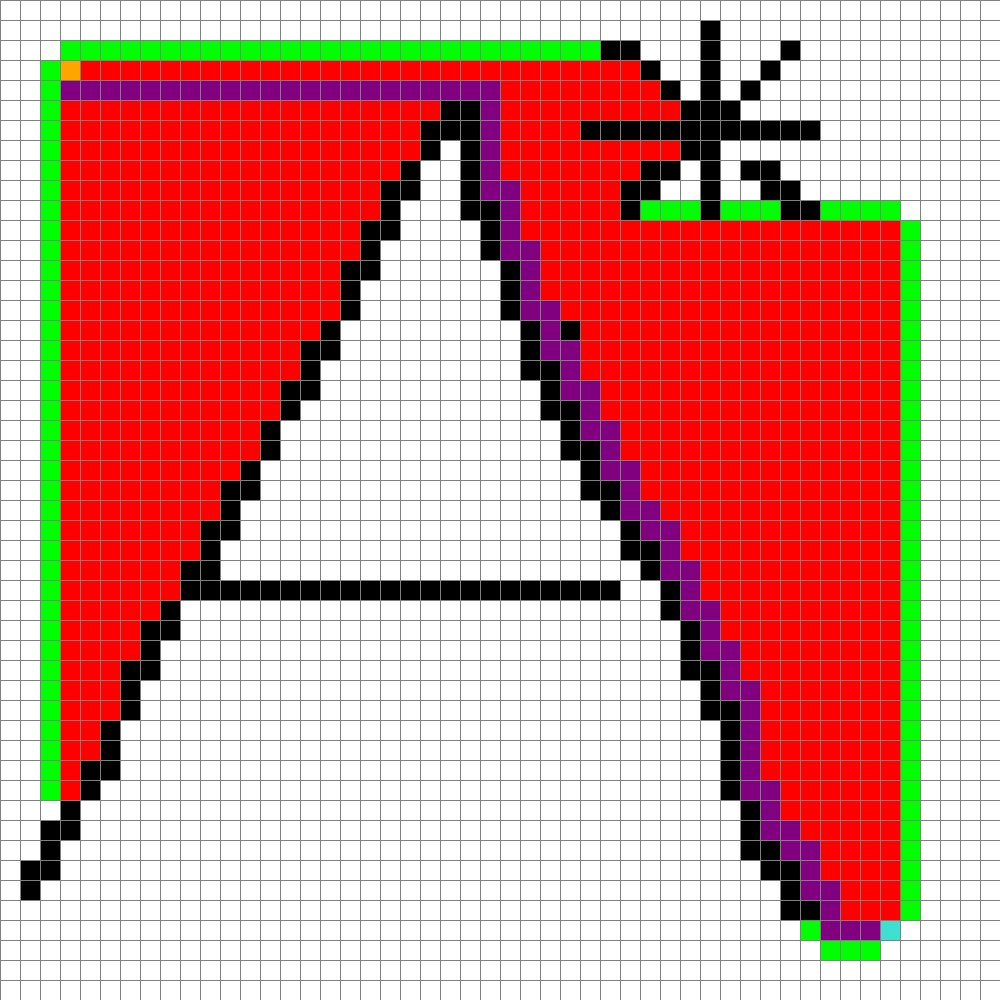

# A Test with A* (A-Star)
I wanted to see if I can build this algorithm. Can I? See for your self! :)

## Requirments
* Python 3.8 or higher
* Pygame

## Uasge
First left Click sets the start point. The second left click sets the end point. The following left clicks will set walls.
A right click will remove the selected element. A following left click should place is back in. 
Pressing SPACE will start the search alorightm and plot the shortest route.
Pressig R will reset the programm.
Pressing S will take a screenshot.